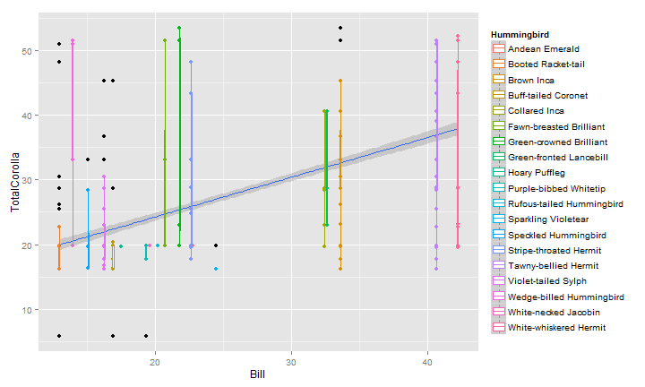

Overlaying Boxplots on Scatter in ggplot2
========================================================


```r
# Phenotypic Matching Among Plants and Birds
require(reshape)
```

```
## Loading required package: reshape
## Loading required package: plyr
## 
## Attaching package: 'reshape'
## 
## The following objects are masked from 'package:plyr':
## 
##     rename, round_any
```

```r
require(ggplot2)
```

```
## Loading required package: ggplot2
```

```r
require(chron)
```

```
## Loading required package: chron
```

```r
require(stringr)
```

```
## Loading required package: stringr
```

```r

# Setwd if not run globally
droppath <- "C:/Users/Ben/Dropbox/"
setwd(droppath)

load("Thesis/Maquipucuna_SantaLucia/Results/PhenotypicMatching.Rdata")

# Begin by plotting Bill Length of the Hummingbird against the Corolla
# Length of the Flower Start with xy scatter
p <- ggplot(m.datH, aes(x = Bill, TotalCorolla, col = Hummingbird)) + geom_point()
p
```

 

```r

# add smoothing line
p <- p + geom_smooth(aes(group = 1), method = "lm")
p
```

 

```r

# There are alot of overlapping points, show boxplots for each species
p + geom_boxplot()
```

```
## Warning: position_dodge requires constant width: output may be incorrect
```

 

```r

# Anyway to enforce width? i know i'm trying to express alot of information
# on this graph.

# I can try
p <- ggplot(m.datH, aes(x = factor(Bill), TotalCorolla, col = Hummingbird)) + 
    geom_boxplot() + geom_smooth(method = "lm", aes(group = 1))
p + geom_point()
```

 

```r

# But i'm very unsure the effect on the smoothing line, as evidence by

p <- ggplot(m.datH, aes(x = factor(Bill), TotalCorolla, col = Hummingbird)) + 
    geom_boxplot() + geom_smooth(method = "lm", aes(x = Bill, group = 1))
p + geom_point()
```

 

