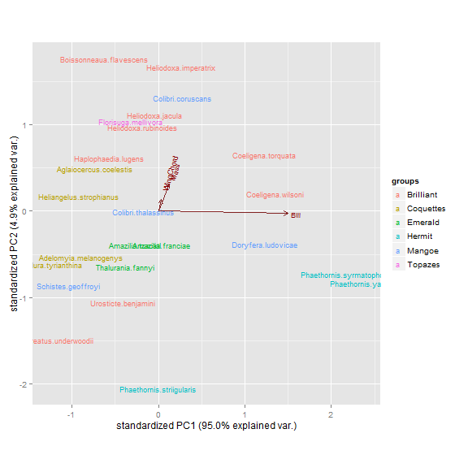
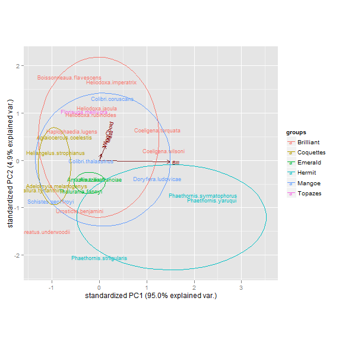
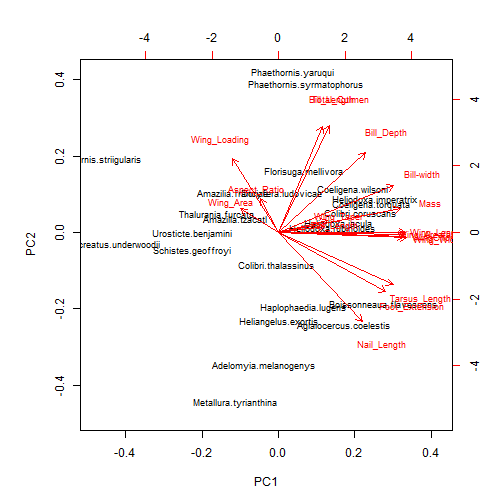
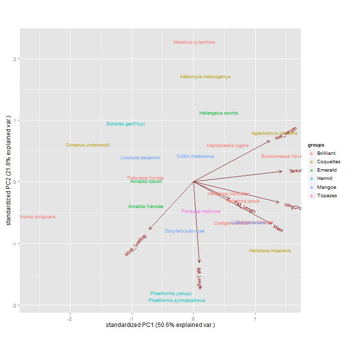
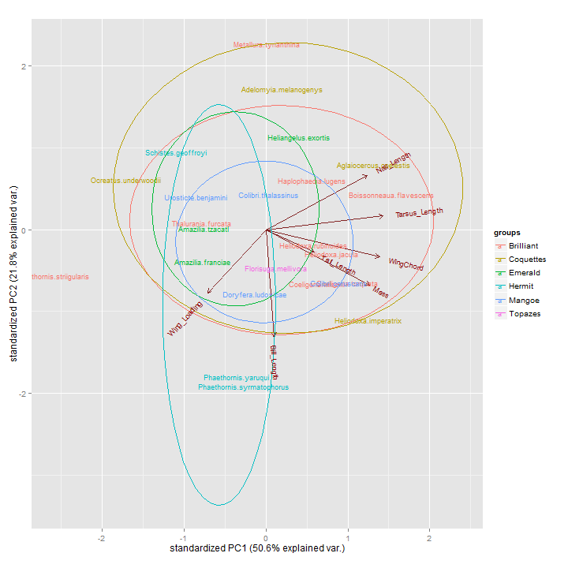
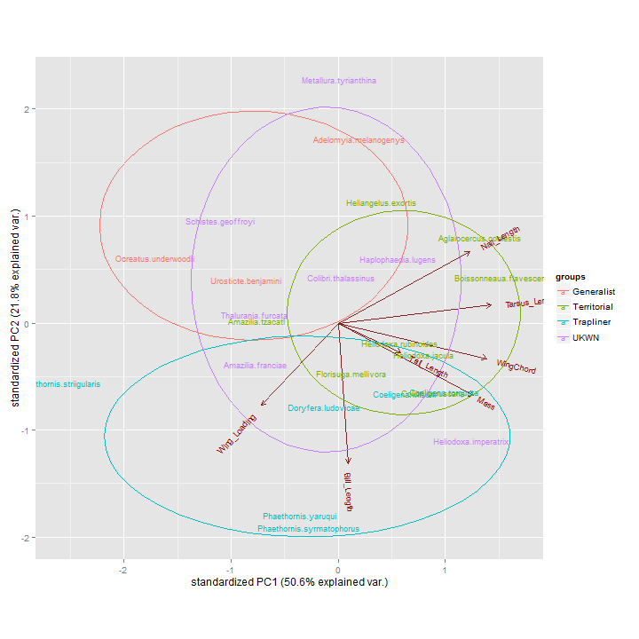

PCA of Maquipucuna and Santa Lucia Hummingbirds 
========================================================

Using three traits (Bill length, Wing Chord, and Mass) for males
------------

Bring in and format the data, need a couple dev libraries from github for plotting 


```r
# Data Collected by Holger Beck,K. Lohman and B. Weinstein R script Ben
# Weinstein - Stony Brook University 7/7/2013 Under Git repository -
# Maquipucuna

require(vegan)
require(reshape2)
require(ggplot2)
require(grid)
require(GGally)

# needs dev library ggbiplot,install if needed.  require(devtools)
# install_github('ggbiplot', 'vqv')
library(ggbiplot)
# 

# setwd to dropbox
droppath <- "C:/Users/Jorge/Dropbox/"
setwd(droppath)
# Set github path
gitpath <- "C:/Users/Jorge/Documents/Maquipicuna/"

# if not being sourced from Specialization.R, run the next line to get the
# env
# save.image('Thesis/Maquipucuna_SantaLucia/Results/Network/NetworkData.Rdata')

# load in dataset that holds my species observations,
load("Thesis/Maquipucuna_SantaLucia/Results/Network/NetworkData.Rdata")

# bring in clade data
clades <- read.csv(paste(gitpath, "InputData//CladeList.txt", sep = ""), header = FALSE)[, 
    -1]
colnames(clades) <- c("Clade", "Genus", "Species", "double", "English")
clades <- clades[, 1:5]

### Bring in trait data, made possible by G. Stiles
morph <- read.csv(paste(gitpath, "InputData//MorphologyShort.csv", sep = ""), 
    na.strings = "9999")

# just get males
morph.male <- morph[morph$Sex == "Macho", c("SpID", "ExpC", "Peso", "AlCdo")]
morph.complete <- morph.male[complete.cases(morph.male), ]

# aggregate for species
agg.morph <- aggregate(morph.complete, list(morph.complete$SpID), mean)
mon <- agg.morph[, -2]
colnames(mon) <- c("Species", "Bill", "Mass", "WingChord")
rownames(mon) <- gsub(" ", ".", mon[, 1])
mon <- mon[, -1]

# Standardize traits using zscore
zscore <- apply(mon, 2, function(x) {
    y <- (x - mean(x))/sd(x)
    return(y)
})

# match the species to the names at the site

# Clean English Names Get the scientific names to match to the morphology
# dataset

# which english names have errors?
errors <- levels(dat$Hummingbird)[!levels(dat$Hummingbird) %in% clades$English]

# Fix the levels
levels(dat$Hummingbird)[!levels(dat$Hummingbird) %in% clades$English] <- c("Andean Emerald", 
    "Fawn-breasted Brilliant", "Gorgeted Sunangel", "Tyrian Metaltail")

# Add a species never seen, but known from the siote
sp.list <- c(levels(dat$Hummingbird), "Empress Brilliant")
sci.name <- clades[clades$English %in% sp.list, "double"]

# The trait dataset has . instead of ' '
site.trait <- z.scores[rownames(z.scores) %in% gsub(" ", ".", sci.name), ]
trait_pc <- prcomp(site.trait)
```


View PCA

```r
print(trait_pc)
```

```
## Standard deviations:
## [1] 8.3125 1.8827 0.2603
## 
## Rotation:
##               PC1      PC2      PC3
## Bill      0.99637 -0.08464  0.00928
## Mass      0.08155  0.91736 -0.38962
## WingChord 0.02446  0.38896  0.92093
```


Plot PCA - a bit ugly default

```r
# normal plot, kinda ugly, need to zoom in
biplot(trait_pc, cex = 0.75)
```

 


Use dev libary to ggplot PCA, color by clades

```r
# Try the ggplot biplot to color by clades (or later, behavioral roles)
toCol <- clades[gsub(" ", ".", clades$double) %in% rownames(trait_pc$x), "Clade"]

# Label species names and clades
ggbiplot(trait_pc, groups = toCol, labels = rownames(trait_pc$x))
```

 


optionally add in circles covering normal distribution of groups

```r
ggbiplot(trait_pc, groups = toCol, labels = rownames(trait_pc$x), ellipse = TRUE)
```

 


17 trait data cut into Least Correlated 7 Traits
=========================


```r
morph17 <- read.csv(paste(gitpath, "InputData//Morphology_Full.csv", sep = ""), 
    na.strings = 9999)

# only want the first 21 cols and spname
colnames(morph17)
```

```
##  [1] "MorphID"        "SpID"           "Sex"            "N"             
##  [5] "ExpC"           "Peso"           "Acom"           "TotC"          
##  [9] "AlCdo"          "PrfP"           "AlAnc"          "AlLgo"         
## [13] "Rasp"           "Rform"          "WiLo"           "Wtap"          
## [17] "AlArea"         "ColaL"          "PataE"          "TarsL"         
## [21] "UnaL"           "PsoSD"          "ExpCSD"         "AcomSD"        
## [25] "TotCSD"         "AlCdoSD"        "PrfPSD"         "AlAncSD"       
## [29] "AlLgoSD"        "RaspSD"         "RformSD"        "WiLoSD"        
## [33] "WtapSD"         "AlAreaSD"       "ColaLSD"        "PataESD"       
## [37] "TarsLSD"        "UnaLSD"         "ReferenceID"    "LocalityID"    
## [41] "MuseumID"       "Notes"          "Subspeciesname" "spname"
```

```r
morph17 <- morph17[, c(1:21, 44)]

# Name in English
colnames(morph17) <- c("MorphID", "SpID", "Sex", "N", "Bill_Length", "Mass", 
    "Bill_width", "Total_Culmen", "WingChord", "Bill_Depth", "Wing_Width", "Wing_Length", 
    "Aspect_Ratio", "Wing_Area", "Wing_Loading", "Wing_Taper", "Wing_Area2", 
    "Tail_Length", "Foot_Extension", "Tarsus_Length", "Nail_Length", "Species")

# just get males
morph.male <- morph17[morph17$Sex == "Macho", ]

# aggregate for species, remove last column
agg.morph <- aggregate(morph.male, list(morph.male$Species), mean, na.rm = TRUE)
mon <- agg.morph[, -23]

# name first column Species
colnames(mon)[1] <- c("Species")

# make into rownames
rownames(mon) <- mon[, 1]
mon <- mon[, -1]

# get traits for the species at the site, replace period with space
trait17 <- mon[rownames(mon) %in% gsub(" ", ".", sci.name), ]

nrow(trait17)
```

```
## [1] 22
```

```r

# Which species did we miss
missing <- gsub(" ", ".", sci.name)[!gsub(" ", ".", sci.name) %in% rownames(mon)]

# Add in closest related species for the species we are missing
trait17 <- rbind(trait17, mon[c("Heliangelus.exortis", "Thalurania.furcata"), 
    ])

# take out columns unwanted in the PCA
head(trait17)
```

```
##                         MorphID SpID Sex  N Bill_Length Mass Bill_width
## Adelomyia.melanogenys       1.5    2  NA 16       15.04 4.24      5.075
## Aglaiocercus.coelestis      3.0    8  NA 13       16.24 6.07      6.040
## Amazilia.franciae          11.0   32  NA 19       22.71 5.27      5.680
## Amazilia.tzacatl           14.0   20  NA 25       20.14 5.02      5.950
## Boissonneaua.flavescens    20.0   57  NA 13       16.88 8.43      6.750
## Coeligena.torquata         49.0  116  NA 18       32.41 7.58      6.270
##                         Total_Culmen WingChord Bill_Depth Wing_Width
## Adelomyia.melanogenys          17.05     55.87       1.87      22.48
## Aglaiocercus.coelestis         18.87     68.68       2.16      25.52
## Amazilia.franciae              25.23     55.03       2.28      19.92
## Amazilia.tzacatl               22.12     55.54       2.17      20.67
## Boissonneaua.flavescens        19.92     78.42       2.25      28.49
## Coeligena.torquata             36.03     78.70       2.23      29.46
##                         Wing_Length Aspect_Ratio Wing_Area Wing_Loading
## Adelomyia.melanogenys         62.09         7.05      2.76         0.19
## Aglaiocercus.coelestis        76.81         7.71      3.00         0.19
## Amazilia.franciae             61.31         7.68      3.07         0.26
## Amazilia.tzacatl              62.66         7.52      3.03         0.24
## Boissonneaua.flavescens       87.66         7.75      3.07         0.21
## Coeligena.torquata            87.23         7.66      2.96         0.19
##                         Wing_Taper Wing_Area2 Tail_Length Foot_Extension
## Adelomyia.melanogenys        0.275      10.93       37.44          12.25
## Aglaiocercus.coelestis       0.280      15.31       92.56          14.07
## Amazilia.franciae            0.240       9.79       33.42          10.93
## Amazilia.tzacatl             0.240      10.45       32.93          10.62
## Boissonneaua.flavescens      0.250      19.86       47.06          14.20
## Coeligena.torquata           0.290      19.87       45.86          11.92
##                         Tarsus_Length Nail_Length
## Adelomyia.melanogenys           6.095        4.11
## Aglaiocercus.coelestis          6.430        4.22
## Amazilia.franciae               5.310        2.87
## Amazilia.tzacatl                5.240        2.77
## Boissonneaua.flavescens         6.680        4.26
## Coeligena.torquata              5.850        3.57
```

```r
trait17 <- trait17[, -c(1, 2, 3, 4)]


# Standard the matrix to correct for different units by subtracting the
# means and dividing by sd
zscore <- apply(trait17, 2, function(x) {
    y <- (x - mean(x))/sd(x)
    return(y)
})

# Take only reasonably uncorrelated traits
trait_keep <- c("Mass", "Bill_Length", "WingChord", "Wing_Loading", "Tarsus_Length", 
    "Tail_Length", "Nail_Length")

zscore_sub <- zscore[, colnames(zscore) %in% trait_keep]
```


View PCA 


```r
trait_pc <- prcomp(zscore_sub)
```


```r
# normal plot, kinda ugly, need to zoom in
biplot(trait_pc, cex = 0.75)
```

 


GGplot PCA to view clades


```r
# Try the ggplot biplot to color by clades (or later, behavioral roles)
toCol <- clades[gsub(" ", ".", clades$double) %in% rownames(trait_pc$x), "Clade"]

# Label species names and clades
ggbiplot(trait_pc, groups = toCol, labels = rownames(trait_pc$x))
```

 


optionally add in circles


```r
ggbiplot(trait_pc, groups = toCol, labels = rownames(trait_pc$x), ellipse = TRUE)
```

 


Define Roles

```r
rownames(trait_pc$x)
```

```
##  [1] "Adelomyia.melanogenys"     "Aglaiocercus.coelestis"   
##  [3] "Amazilia.franciae"         "Amazilia.tzacatl"         
##  [5] "Boissonneaua.flavescens"   "Coeligena.torquata"       
##  [7] "Coeligena.wilsoni"         "Colibri.coruscans"        
##  [9] "Colibri.thalassinus"       "Doryfera.ludovicae"       
## [11] "Florisuga.mellivora"       "Haplophaedia.lugens"      
## [13] "Heliodoxa.imperatrix"      "Heliodoxa.jacula"         
## [15] "Heliodoxa.rubinoides"      "Metallura.tyrianthina"    
## [17] "Ocreatus.underwoodii"      "Phaethornis.striigularis" 
## [19] "Phaethornis.syrmatophorus" "Phaethornis.yaruqui"      
## [21] "Schistes.geoffroyi"        "Urosticte.benjamini"      
## [23] "Heliangelus.exortis"       "Thalurania.furcata"
```

```r
roles <- factor(c("Generalist", "Territorial", "UKWN", "Territorial", "Territorial", 
    "Trapliner", "Trapliner", "Territorial", "UKWN", "Trapliner", "Territorial", 
    "UKWN", "UKWN", "Territorial", "Territorial", "UKWN", "Generalist", "Trapliner", 
    "Trapliner", "Trapliner", "UKWN", "Generalist", "Territorial", "UKWN"))

ggbiplot(trait_pc, groups = roles, labels = rownames(trait_pc$x), ellipse = TRUE)
```

 

