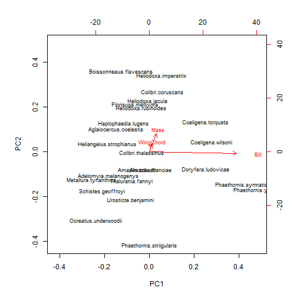
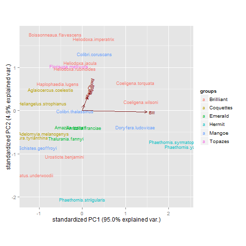
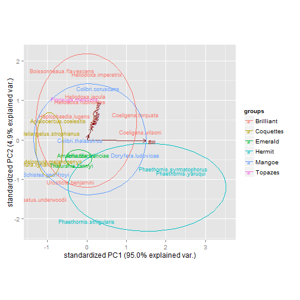

PCA of Maquipucuna and Santa Lucia Hummingbirds 
========================================================

Using three traits (Bill length, Wing Chord, and Mass) for males
------------

Bring in and format the data, need a couple dev libraries from github for plotting 


```r
# Data Collected by Holger Beck,K. Lohman and B. Weinstein R script Ben
# Weinstein - Stony Brook University 7/7/2013 Under Git repository -
# Maquipucuna

require(vegan)
require(reshape2)
require(ggplot2)
require(grid)

# needs dev library ggbiplot,install if needed.  require(devtools)
# install_github('ggbiplot', 'vqv')
library(ggbiplot)
# 

# setwd to dropbox
droppath <- "C:/Users/Jorge/Dropbox/"
setwd(droppath)
# Set github path
gitpath <- "C:/Users/Jorge/Documents/Maquipicuna/"

# if not being sourced from Specialization.R, run the next line to get the
# env
# save.image('Thesis/Maquipucuna_SantaLucia/Results/Network/NetworkData.Rdata')

# load in dataset that holds my species observations,
load("Thesis/Maquipucuna_SantaLucia/Results/Network/NetworkData.Rdata")

# bring in clade data
clades <- read.csv(paste(gitpath, "InputData//CladeList.txt", sep = ""), header = FALSE)[, 
    -1]
colnames(clades) <- c("Clade", "Genus", "Species", "double", "English")
clades <- clades[, 1:5]

### Bring in trait data, made possible by G. Stiles
morph <- read.csv(paste(gitpath, "InputData//MorphologyShort.csv", sep = ""), 
    na.strings = "9999")

# just get males
morph.male <- morph[morph$Sex == "Macho", c("SpID", "ExpC", "Peso", "AlCdo")]
morph.complete <- morph.male[complete.cases(morph.male), ]

# aggregate for species
agg.morph <- aggregate(morph.complete, list(morph.complete$SpID), mean)
mon <- agg.morph[, -2]
colnames(mon) <- c("Species", "Bill", "Mass", "WingChord")
rownames(mon) <- gsub(" ", ".", mon[, 1])
mon <- mon[, -1]

# principal component traits and get euclidean distance matrix
means <- apply(mon, 2, mean)

# Standard the matrix to correct for different units
Bill <- mon$Bill - means["Bill"]/sd(mon$Bill)
Mass <- mon$Mass - means["Mass"]/sd(mon$Mass)
WingChord <- (mon$WingChord - means["WingChord"])/sd(mon$WingChord)

z.scores <- data.frame(Bill, Mass, WingChord)
rownames(z.scores) <- rownames(mon)

# match the species to the names at the site

# Clean English Names Get the scientific names to match to the morphology
# dataset

# which english names have errors?
errors <- levels(dat$Hummingbird)[!levels(dat$Hummingbird) %in% clades$English]

# Fix the levels
levels(dat$Hummingbird)[!levels(dat$Hummingbird) %in% clades$English] <- c("Andean Emerald", 
    "Fawn-breasted Brilliant", "Gorgeted Sunangel", "Tyrian Metaltail")

# Add a species never seen, but known from the siote
sp.list <- c(levels(dat$Hummingbird), "Empress Brilliant")
sci.name <- clades[clades$English %in% sp.list, "double"]

# The trait dataset has . instead of ' '
site.trait <- z.scores[rownames(z.scores) %in% gsub(" ", ".", sci.name), ]
trait_pc <- prcomp(site.trait)
```


View PCA

```r
print(trait_pc)
```

```
## Standard deviations:
## [1] 8.3125 1.8827 0.2603
## 
## Rotation:
##               PC1      PC2      PC3
## Bill      0.99637 -0.08464  0.00928
## Mass      0.08155  0.91736 -0.38962
## WingChord 0.02446  0.38896  0.92093
```


Plot PCA - a bit ugly default

```r
# normal plot, kinda ugly, need to zoom in
biplot(trait_pc, cex = 1)
```

 


Use dev libary to ggplot PCA, color by clades

```r
# Try the ggplot biplot to color by clades (or later, behavioral roles)
toCol <- clades[gsub(" ", ".", clades$double) %in% rownames(trait_pc$x), "Clade"]

# Label species names and clades
ggbiplot(trait_pc, groups = toCol, labels = rownames(trait_pc$x))
```

 


optionally add in circles covering normal distribution of groups

```r
ggbiplot(trait_pc, groups = toCol, labels = rownames(trait_pc$x), ellipse = TRUE)
```

 


