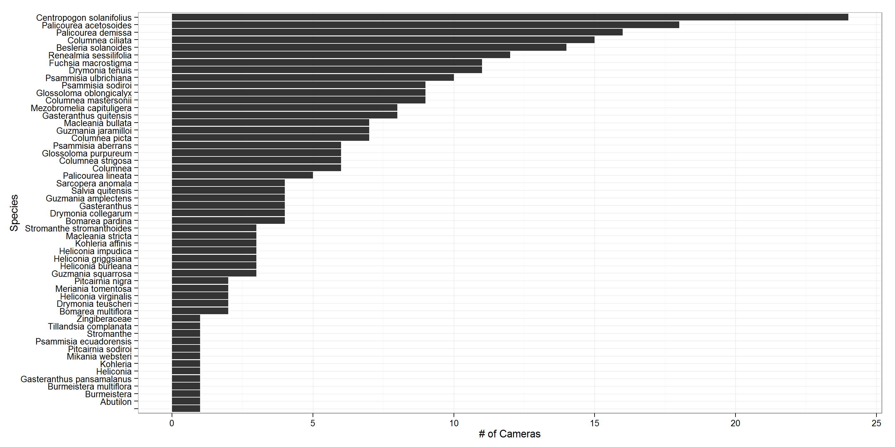

#Introduction

* Species mutualisms are under growing threat from climate change. 

* The tightness and fidelity of these interactions are shaped by evolutionary forces promoting specialization and generalization.

* In additon, the stability of these interactions depends on their relative specialization and generalization. Generalist interactions are likley to be more robust to climatic changes and maintain ecosystem services. 

* The dominant theory for pollinator specialization posits that selection should promote adaptations for the most effecive pollinator.

* However, this hypothesis ignores how a pollinator interactions with the surrounding biotic enviroment.

  * When is it mutalism, thompson.

* In nature, biotic interactions occur against a shifting background of resource availability.

* In addition many specialist show temporal change in feeding behavior.

  * Liem's paradox.
    
* In this work we evaluate the effect of resource availability on niche overlap and specialization in Andean Hummingbirds.

* Nectar is the non-equilibirial resource with niche breadth measured as the diversity of plants visited and specialization the diversity of plants visited versus the number of available plants.

* Nectar availability changes drastically thoughout the year (Jun-Oct high availability)

* In light of this variation in resource abundance, we test two opposing theories exist for how pollinators should specialize for potential nectar resources. 

###Specialization should increase as available resources increases

* When there are an abundance of available resources, species do not suffer as much cost from competition. The plethora of option leads to decreased specialization as species maximize amount of time feeding and reduced time foraging for their specialized resource.
The observation that many morphological specialists forage as generalists during periods of high resource availability led to Liem’s Paradox in cichlids. Sloan-Wilson () suggested that the solution to this paradox is that the specialists fall back on private resources in time of low scarcity, which promotes greater morphological specialization.

  * MacArthur and Levins 1967, Abrams 1983), and niche partitioning (sensu MacArthur 1958, Pianka 1974, 1976, Schoener 1974) predict that stable coexistence of competing species is achieved through niche differenti- ation that reduces overlap among competitors. Thus, during periods of relative food scarcity, animals are expected to adjust feeding to reduce niche overlap with competitors.

###Specialization should decrease as available resources increases
* Optimal foraging suggests that as resource availability increases, species should specialize on resources which reduce handling time and increase efficiency. 

  * At times of low resource availablity species cannot be choosy, and must forgage on whatever plants are available. Species should prefer to partition resource space when possible, as to reduced competition among species. 

* We divide the plant-pollinator assemblage into temporal partitions to evaluate how co-occuring plants and pollinators partition resource space.

####Trait-Matching and Specialization

The above hypothesis predict a pattern of specialization and resources, but provide no direct mechanism by which species choose which resource for specialization. It has been repeated suggested that hummingbird foodplant specialization is mediated through bill-corolla phenotype matching. We therefore expect that as specialization increase, the strength of phenotypic matching should decrease. When given a choice, species should pick the flowers which reduce competition and closely match their bill morphology.

####Hummingbird network ecology

* Previous work
  * Maglianesi, M., Blüthgen, N., Böhning-Gaese, K., & Schleuning, M. (2014). Morphological traits determine specialization and resource use in plant-hummingbird networks in the Neotropics. Ecology, In press.
  * Vizentin-bugoni, J., Maruyama, P. K., & Sazima, M. (2014). Processes entangling interactions in communities: forbidden links are more important than abundance in a hummingbird–plant network. Proceedings of the Royal Society B: Biological Sciences, 281.

#Methods

# Specialization over time

We use two parallel methods to estimate the role of available resources in shaping specialization and trait matching in hummingbirds.

##Figure 1 - Conceptual figure for specialization and changing available resources.

##Figure 2 -

#Network measures over time
###Compare to randomization of the interaction matrix to account for differences in sampling. 

#Specialization, Connectance and Niche Overlap as a function of available resources.

## Trait matching

