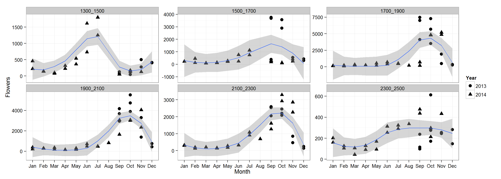

Specialization and Plant - Hummingbird Interactions: Synopsis of Current Results
========================================================

Data Collection
-------
DATA COLLECTION AND SOURCES
- Flower Transects (1300-2500m,  6 transects, 2x/Month) – Estimate the total available hummingbird resources

Q1: How do available resources change along the elevation gradient over time?
 


Table of 10 most abundant hummingbird visited plants with total number of flowers records


```r
require(xtable)

planttable <- aggregate(full.fl$Total_Flowers, by = list(toupper(full.fl$Family), 
    full.fl$Iplant_Double), sum)

plantT <- na.omit(planttable[order(planttable$x), ])

print(xtable(plantT[1:10, ]), type = "html")
```

<!-- html table generated in R 3.0.2 by xtable 1.7-1 package -->
<!-- Mon Jan 27 21:52:19 2014 -->
<TABLE border=1>
<TR> <TH>  </TH> <TH> Group.1 </TH> <TH> Group.2 </TH> <TH> x </TH>  </TR>
  <TR> <TD align="right"> 12 </TD> <TD> RUBIACEAE </TD> <TD>  </TD> <TD align="right"> 1.00 </TD> </TR>
  <TR> <TD align="right"> 59 </TD> <TD> GESNERIACEAE </TD> <TD> Gasteranthus_leopardus </TD> <TD align="right"> 1.00 </TD> </TR>
  <TR> <TD align="right"> 71 </TD> <TD> GESNERIACEAE </TD> <TD> Heppiella </TD> <TD align="right"> 1.00 </TD> </TR>
  <TR> <TD align="right"> 91 </TD> <TD> ERICACEAE </TD> <TD> Palicourea_lineata </TD> <TD align="right"> 1.00 </TD> </TR>
  <TR> <TD align="right"> 19 </TD> <TD> GESNERIACEAE </TD> <TD> Alloplectus_tenuis </TD> <TD align="right"> 2.00 </TD> </TR>
  <TR> <TD align="right"> 22 </TD> <TD> BEGONIACEAE </TD> <TD> Begonia </TD> <TD align="right"> 2.00 </TD> </TR>
  <TR> <TD align="right"> 47 </TD> <TD> GESNERIACEAE </TD> <TD> Columnea_stricta </TD> <TD align="right"> 2.00 </TD> </TR>
  <TR> <TD align="right"> 52 </TD> <TD> GESNERIACEAE </TD> <TD> Drymonia_brochidodroma </TD> <TD align="right"> 2.00 </TD> </TR>
  <TR> <TD align="right"> 63 </TD> <TD> GUNNERACEAE </TD> <TD> Gunnera </TD> <TD align="right"> 2.00 </TD> </TR>
  <TR> <TD align="right"> 74 </TD> <TD> ACANTHACEAE </TD> <TD> Justicia </TD> <TD align="right"> 2.00 </TD> </TR>
   </TABLE>


- Hummingbird Transects (1300-2500m,  6 transects, 2x/Month) – Collect geospatial data on hummingbird elevation ranges and interactions


- Hummingbird Flower Cameras (6am-6pm,2days,~30X/Month, placed at the most abundant flower resources)

- Flower Morphology (Corolla width, corolla length for majority of species, nectar concentration for a subset)

- Hummingbird Morphology (for all but 1 species, 17 morphological traits, from Gary Stiles)

- Flower Phylogeny (Genus Level phylogeny with branch lengths informed by the Angiosperm supertree)

-	Hummingbird Phylogeny (Both a molecular divergence and time tree are available for all species, from Jimmy McGuire)

-	Fine-scale temperature data (35 ibuttons were placed along the elevation transect to record temperature every hr for 1 year)


```r
summary(cars)
```

```
##      speed           dist    
##  Min.   : 4.0   Min.   :  2  
##  1st Qu.:12.0   1st Qu.: 26  
##  Median :15.0   Median : 36  
##  Mean   :15.4   Mean   : 43  
##  3rd Qu.:19.0   3rd Qu.: 56  
##  Max.   :25.0   Max.   :120
```


You can also embed plots, for example:


```r
plot(cars)
```

 


